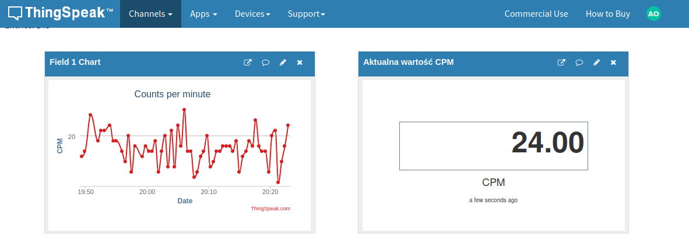
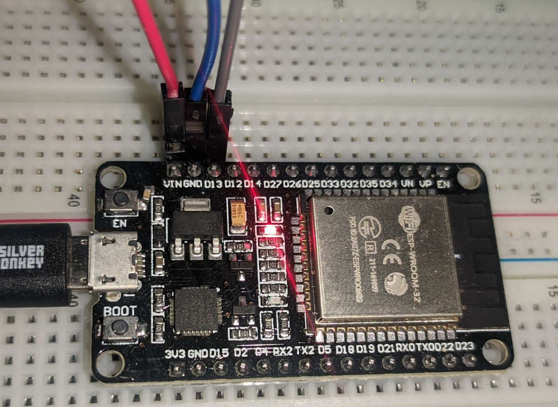
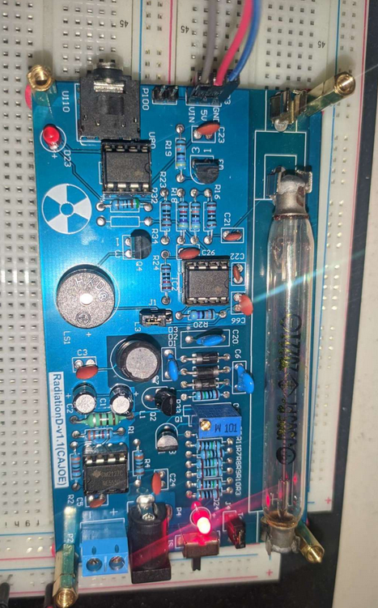

# Arduino Geiger Counter
Using this project You will be able to monitor current radiation in Your room.

# Things needed
1. ESP 32 Devkit
2. RadiationD v1.1 kit
3. Free ThingSpeak account and channel created 

# Connections required
    
    | ESP32   | RadiationD board | Description                 |
    ------------------------------------------------------------
    | VIN(5V) | 5V               | Power supply for the sensor |
    | GND     | GND              | Ground                      |
    | D13     | VIN              | Sensor interrupt signal     |

# Photos

# Helpful resources
* [Calibration guide](docs/En_Calibration_GMv1.1.pdf)
* [Data conversion](docs/*How%20to%20convert%20the%20conuters%20from%20Geiger%20Counter%20Kit.pdf)
* [Geiger Board schematics](docs/Sch__Geiger%20Counter%20Kit-v1.1.pdf)
* [ESP32 Devkit pinout](images/ESP32-Pinout.jpg)